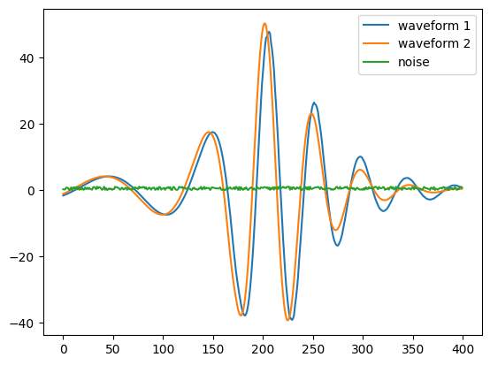
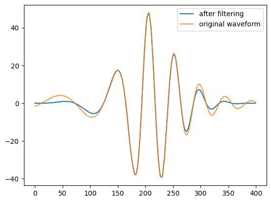

Examples of evaluation method
===================================

.. autosummary::
   :toctree: generated

Data evaluation
---------------

Firstly, activating ``waveform`` environment.

.. code-block:: console
    :linenos:

    $ conda activate waveform
    $ cd /workspace/GWDA_lib/docs/source

Then, loading demo data of waveforms: ``w1.npy, w2.npy, noise.npy``, and plotting waveforms and noise.

>>> import matplotlib.pyplot as plt
>>> w1 = np.load('docs/source/w1.npy')
>>> w2 = np.load('docs/source/w2.npy')
>>> noise = np.load('docs/source/noise.npy')
>>> print('w1 shape: ', w1.shape)
w1 shape:  (400,)

.. code-block:: python
    :linenos:

    import matplotlib.pyplot as plt
    plt.plot(w1, label='waveform 1')
    plt.plot(w2, label='waveform 2')
    plt.plot(noise, label='noise')
    plt.legend()
    # plt.savefig(f'demo.png', dpi=100)
    plt.show()

:download:`Source code <evaluate.ipynb>`, :download:`demo.png <signal_noise.png>`

Tukey Filter
^^^^^^^^^^^^
.. code-block:: python
    :linenos:

    import matplotlib.pyplot as plt
    tmp = tukey(w1.shape[0], alpha=0.8)
    plt.plot(tmp*w1, label= 'after filtering')
    plt.plot(w1, label='original waveform', alpha=0.8)
    plt.legend()
    # plt.savefig(f'tukey.png', dpi=100)
    plt.show()

:download:`Source code <evaluate.ipynb>`, :download:`tukey.png <tukey.png>`

SNR
^^^^^^^^^^^^
>>> snr = get_amp_snr(w1, noise)
>>> print('snr: ', snr)
snr:  25.198280479785378

Model evaluation
------------------

MSE Loss
^^^^^^^^

>>> pred = torch.tensor(w1.reshape(1,-1))
>>> label = torch.tensor(w2.reshape(1,-1))
>>> mse = mse_loss(pred, label)
>>> print('mse loss: ', mse)
mse loss:  tensor(44.5499, dtype=torch.float64)

Downstream task evaluation
----------------------------

Corner plot
^^^^^^^^^^^^^

.. code-block:: python
    :linenos:

    corner_plot(w1)

:download:`corner1.png <corner1.png>`

.. image:: corner1.png
  :width: 200px

.. ROC Curve
.. ^^^^^^^^^

