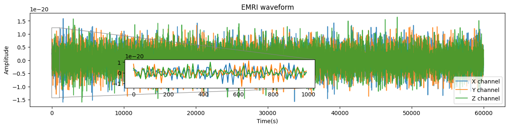
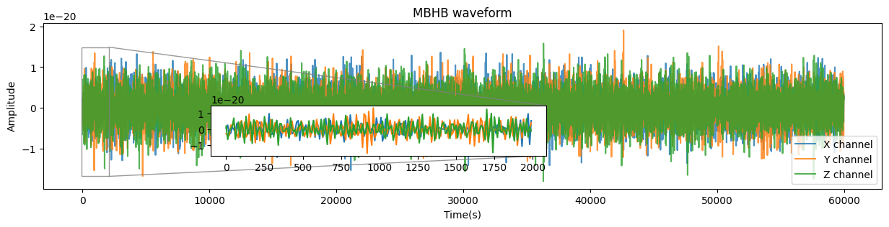
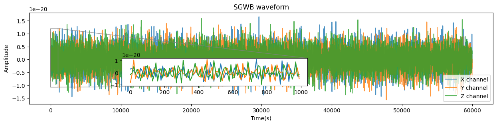
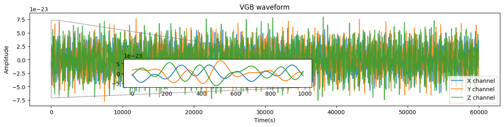

###############################################################
Examples of space-based gravitational wave signal generation
###############################################################

.. autosummary::
   :toctree: generated

.. _emri:

===============
EMRIs waveform
===============

By running `emri_demo.py <https://github.com/YueZhou-oh/GWDA_lib/blob/main/demos/emri_demo.py>`_ script, a EMRIs waveform example is generated. 

The default signal length is two years and default sampling rate is 10 seconds, 
and the generated waveform is saved at the same directory as ``test_EMRI.hdf5``.
You can adapt the configurations in `emri_demo.py <https://github.com/YueZhou-oh/GWDA_lib/blob/main/demos/emri_demo.py>`_ according to your own needs.

.. code-block:: console
    :linenos:

    $ conda activate waveform
    $ cd /workspace/GWDA_lib/demos
    $ python emri_demo.py
    $ ls *EMRI*
    test_EMRI.hdf5

To visulize the generated waveform, firstly you need to load the ``test_EMRI.hdf5`` file.

>>> import h5py
>>> source = 'EMRI'
>>> f = h5py.File(f"test_{source}.hdf5", "r")
>>> all_keys = [key for key in f.keys()]
>>> d = f[all_keys[0]]
>>> print(f.filename, ":", all_keys)
>>> print(d.name, ":", d.shape)     # 10s sampling rate, 2-year-length waveform
>>> print(d[:])
test_EMRI.hdf5 : ['TDIdata']
/TDIdata : (4, 6311630)
[[ 0.00000000e+00  1.00000000e+01  2.00000000e+01 ...  6.31162720e+07
   6.31162800e+07  6.31162880e+07]
 [ 2.39214973e-21  2.85723663e-21  1.17999299e-21 ... -2.99196318e-21
  -5.15871471e-21  3.03701580e-21]
 [ 8.12895951e-21 -3.59335741e-21  7.26437602e-23 ... -1.12794030e-21
  -7.39320486e-21  3.79989830e-21]
 [ 4.23084649e-21  1.36245475e-21 -3.16980953e-21 ... -4.44047238e-21
   6.76437277e-21 -3.37023952e-21]]

Then by running ``plot_waveform.py``, detailed information of the waveform is presented.

.. code-block:: python
    :linenos:

    import matplotlib.pyplot as plt
    from mpl_toolkits.axes_grid1.inset_locator import inset_axes
    fig = plt.figure(figsize=(15,3), facecolor='white', dpi=100)
    ax = fig.add_subplot(111)
    ax.plot(d[0,:6000], d[1,:6000], alpha=0.8, label='X channel')
    ax.plot(d[0,:6000], d[2,:6000], alpha=0.8, label='Y channel')
    ax.plot(d[0,:6000], d[3,:6000], alpha=0.8, label='Z channel')
    ax.legend(loc="lower right")
    ax.set_xlabel('Time(s)')
    ax.set_ylabel('Amplitude')
    ax.set_title(f'{source} waveform')
    axins = ax.inset_axes((0.2, 0.2, 0.4, 0.3))
    pt = 500
    axins.plot(d[0,:pt], d[1,:pt])
    axins.plot(d[0,:pt], d[2,:pt])
    axins.plot(d[0,:pt], d[3,:pt])
    ax.indicate_inset_zoom(axins, alpha=0.8)
    # plt.savefig(f'{source}_wave.png', dpi=100)
    plt.show()

:download:`Source code <plot_waveform.py>`, :download:`emri.png <emri.png>`

===============
MBHB waveform
===============

The MBHB waveform generation process is similar as :ref:`emri`.
Hence, we only give a brief introduction here.

1. Generate waveform by running `mbhb_demo.py <https://github.com/YueZhou-oh/GWDA_lib/blob/main/demos/mbhb_demo.py>`_.
2. Visulize the generated waveform by running ``plot_waveform.py`` (you only need to choose the corresponding GW source as shown below).

.. code-block:: python
    :linenos:

    import h5py
    # source = 'EMRI'
    source = 'MBHB'
    # source = 'SGWB'
    # source = 'VGB'

:download:`Source code <plot_waveform.py>`, :download:`mbhb.png <MBHB.png>`

===============
SGWB waveform
===============

The SGWB waveform generation process is similar as :ref:`emri`.
Hence, we only give a brief introduction here.

1. Generate waveform by running `sgwb_demo.py <https://github.com/YueZhou-oh/GWDA_lib/blob/main/demos/sgwb_demo.py>`_.
2. Visulize the generated waveform by running ``plot_waveform.py`` (you only need to choose the corresponding GW source as shown below).

.. code-block:: python
    :linenos:

    import h5py
    # source = 'EMRI'
    # source = 'MBHB'
    source = 'SGWB'
    # source = 'VGB'

:download:`Source code <plot_waveform.py>`, :download:`sgwb.png <sgwb.png>`

===============
VGB waveform
===============

The VGB waveform generation process is similar as :ref:`emri`.
Hence, we only give a brief introduction here.

1. Generate waveform by running `vgb_demo.py <https://github.com/YueZhou-oh/GWDA_lib/blob/main/demos/vgb_demo.py>`_.
2. Visulize the generated waveform by running ``plot_waveform.py`` (you only need to choose the corresponding GW source as shown below).

.. code-block:: python
    :linenos:

    import h5py
    # source = 'EMRI'
    # source = 'MBHB'
    # source = 'SGWB'
    source = 'VGB'

:download:`Source code <plot_waveform.py>`, :download:`vgb.png <vgb.png>`

