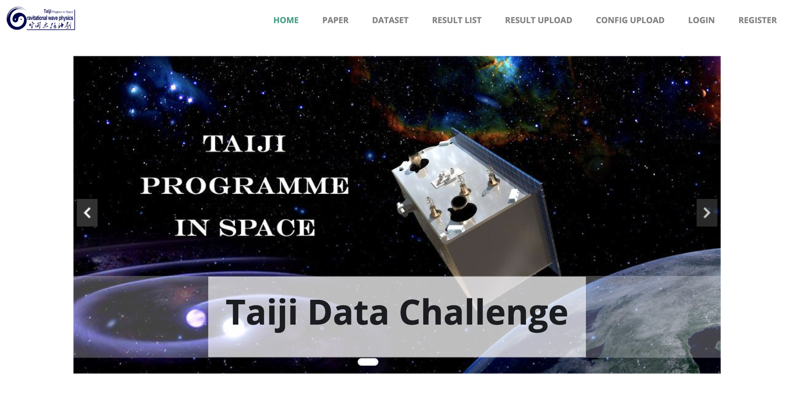
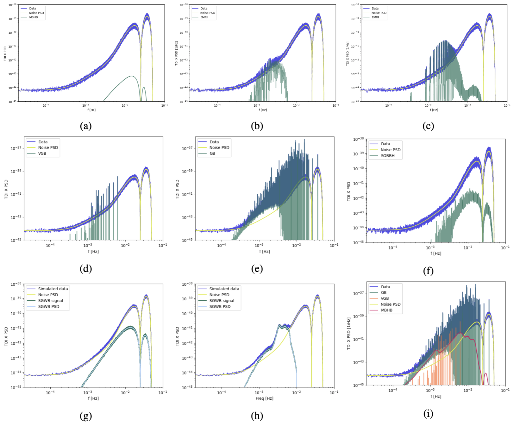

# Taiji Data Challenge for Exploring Gravitational Wave Universe
<div align=center></div>
<br/>

<p align="center">
<a href="https://img.shields.io/badge/License-MIT-green.svg?style=for-the-badge&logo=appveyor)](https://opensource.org/licenses/MIT" alt="License">
    </a>
<a href="https://arxiv.org/abs/2301.02967" alt="arXiv">
    </a>
<a href="https://link.springer.com/article/10.1007/s11467-023-1318-y" alt="DOI">
    </a>
</p>

<p align="justify">
Welcome to the official repository of the Taiji Data Challenge! This repository hosts the data generation code. For more details about the challenge, please refer to the paper: <a href="https://link.springer.com/article/10.1007/s11467-023-1318-y">https://link.springer.com/article/10.1007/s11467-023-1318-y</a>.
</p>

## Table of Contents

- [Taiji Data Challenge for Exploring Gravitational Wave Universe](#taiji-data-challenge-for-exploring-gravitational-wave-universe)
  - [Table of Contents](#table-of-contents)
  - [Introduction](#introduction)
  - [Official Website](#official-website)
  - [Datasets](#datasets)
  - [Results on Toy Dataset](#results-on-toy-dataset)
  - [Project Structure](#project-structure)
  - [Getting Started](#getting-started)
  - [Citation](#citation)
  - [Reference](#reference)


## Introduction

<p align="justify">
The direct observation of gravitational waves (GWs) opens a new window for exploring new physics from quanta to cosmos and provides a new tool for probing the evolution of universe. GWs detection in space covers a broad spectrum ranging over more than four orders of magnitude and enables us to study rich physical and astronomical phenomena. Taiji is a proposed space-based GW detection mission that will be launched in the 2030s. Taiji will be exposed to numerous overlapping and persistent GW signals buried in the foreground and background, posing various data analysis challenges. In order to empower potential scientific discoveries, the Mock Laser Interferometer Space Antenna (LISA) data challenge and the LISA data challenge (LDC) were developed. While LDC provides a baseline framework, the first LDC needs to be updated with more realistic simulations and adjusted detector responses for Taiji’s constellation. In this paper, we review the scientific objectives and the roadmap for Taiji, as well as the technical difficulties in data analysis and the data generation strategy, and present the associated data challenges. In contrast to LDC, we utilize second-order Keplerian orbit and second-generation time delay interferometry techniques. Additionally, we employ a new model for the extreme-mass-ratio inspiral waveform and stochastic GW background spectrum, which enables us to test general relativity and measure the non-Gaussianity of curvature perturbations. Furthermore, we present a comprehensive showcase of parameter estimation using a toy dataset. This showcase not only demonstrates the scientific potential of the Taiji data challenge but also serves to validate the effectiveness of the pipeline. As the first data challenge for Taiji, we aim to build an open ground for data analysis related to Taiji sources and sciences.
</p>

## Official Website

For more detailed information about the challenge, guidelines, and announcements, please visit our [Official Website](https://taiji-tdc.ictp-ap.org/).



## Datasets

Frequency domain data of all the TDC datasets.



## Results on Toy Dataset

MCMC posterior corner plot for the toy dataset. The MCMC posterior analysis is conducted on our toy dataset.


## Project Structure
- `catalog/`: Source catalog.
  - `VGB-catalog.txt`: Catalog of varified galactic binaries originally from [LISA Verification Binaries](https://gitlab.in2p3.fr/LISA/lisa-verification-binaries).
  - `test-SOBBH-catalog.dat`: Random SOBBH sources for the demo.
- `images/`: Images used in this file.
- `orbit/`: orbit file for TDI calculation.
  - `taiji-orbit.hdf5`: Taiji orbit file.
- `tdc/`: TDC source code.
  - `examples/`: Example scripts for data generation.
    - `emri-demo.py`: Generate EMRI data.
    - `mbhb-demo.py`: Generate MBHB data.	
    - `sgwb-demo.py`: Generate sgwb data.
    - `sobbh-demo.py`: Generate SOBBH data.
    - `vgb-demo.py`: Generate vgb data using catalog.
  - `utils/`: Utilities.
    - `constant.py`: Physical constants.
    - `cosmology.py`: Luminosity distance calculation.
    - `log_utils.py`: Logger.
  - `tdi.py`: Class for TDI response calculation.
  - `waveform.py`: Generator class of MBHB, EMRI, GB, and SOBBH waveform.
- `LICENCE`: MIT LICENCE.
- `Makefile`: Code formatting and cleaning recipes.
- `README.md`: This file.


## Getting Started
1. Setup the conda environment:
	```bash
	conda create -n taiji -c conda-forge gcc_linux-64 gxx_linux-64 wget gsl fftw lapack=3.6.1 hdf5 numpy Cython scipy jupyter ipython  matplotlib python=3.7 --yes
	conda activate taiji
	```
2. Install others dependencies:
   - 	```bash
		pip install bidict tqdm h5py requests astropy h5py xarray lisa-data-challenge
		```
   - *(Optional) Install `cupy` following instructions from [https://docs.cupy.dev/en/stable/install.html](https://docs.cupy.dev/en/stable/install.html)*
3. Install [FastEMRIWaveforms](https://github.com/BlackHolePerturbationToolkit/FastEMRIWaveforms) and [lisa-on-gpu](https://github.com/mikekatz04/lisa-on-gpu).
   ```bash
	git clone https://github.com/BlackHolePerturbationToolkit/FastEMRIWaveforms.git 
	cd FastEMRIWaveforms 
	python setup.py install 
	cd ../
	git clone https://github.com/mikekatz04/lisa-on-gpu.git
	cd lisa-on-gpu
	python setup.py install
	cd ../
   ```
4. Run the demo:
   ```bash
   cd demos
   python emri-demo.py
   ...
   ```

## Citation

If you find our code useful, please consider citing the following papers:

```bibtex
@article{ren_taiji_2023,
  title = {Taiji Data Challenge for Exploring Gravitational Wave Universe},
  author = {Ren, Zhixiang and Zhao, Tianyu and Cao, Zhoujian and Guo, Zong-Kuan and Han, Wen-Biao and Jin, Hong-Bo and Wu, Yue-Liang},
  year = {2023},
  month = dec,
  journal = {Frontiers of Physics},
  volume = {18},
  number = {6},
  pages = {64302},
  doi = {10.1007/s11467-023-1318-y},
  language = {en}
}
```

## Reference

We would like to express our gratitude to the following repositories for their invaluable contributions to this work:

- [FastEMRIWaveforms](https://github.com/BlackHolePerturbationToolkit/FastEMRIWaveforms)
- [lisa-on-gpu](https://github.com/mikekatz04/lisa-on-gpu)
- [LISA Verification Binaries](https://gitlab.in2p3.fr/LISA/lisa-verification-binaries)
- [LDC-tutorial](https://github.com/mikekatz04/LDC-waveform-generation-tutorial)